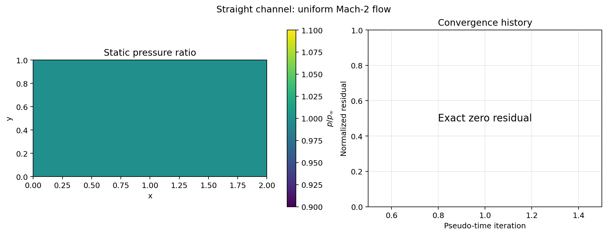
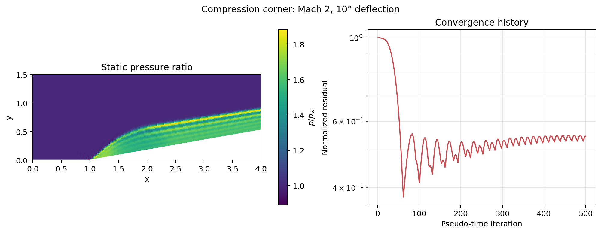
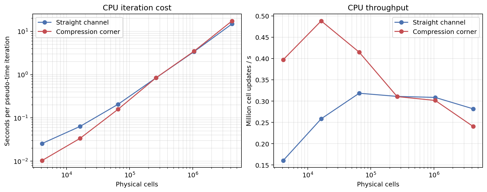

# PyJST

PyJST is a compact, educational finite-volume solver for the two-dimensional
compressible Euler equations. It is written in vectorized Python/NumPy and
implements the Jameson--Schmidt--Turkel (JST) central scheme for steady,
inviscid compressible flow on structured Cartesian and body-fitted grids.

## Scope

The solver is designed as a transparent numerical-method demonstrator rather
than a production CFD package. It solves a calorically perfect gas in SI units
and advances the conservative state

$$
Q = [\rho, \rho u, \rho v, \rho E]^T.
$$

Current capabilities:

- Cell-centred finite-volume discretization of the 2D Euler equations.
- Structured Cartesian and body-fitted quadrilateral meshes.
- Central inviscid face fluxes using physical face vectors.
- JST pressure-sensor artificial dissipation with second- and fourth-order
  components.
- Four-stage explicit pseudo-time Runge--Kutta iteration with local time
  stepping and CFL ramping.
- Periodic, supersonic inflow, supersonic outflow, and structured slip-wall
  ghost-cell conditions.
- Uniform-flow preservation and a Mach-2, 10-degree compression-corner
  benchmark with an analytic weak oblique-shock reference.
- Unit tests for geometry, state conversion, fluxes, dissipation, boundaries,
  solver iteration, and benchmark construction.

It does not currently include viscosity, turbulence modelling, unstructured
meshes, subsonic characteristic boundaries, multigrid, or a GPU backend.

## Numerical method

For each cell of volume (area) \(V_i\), the steady Euler equations are marched
in pseudo-time using

$$
\frac{dQ_i}{d\tau} = -\frac{1}{V_i}\left(R_i^{\mathrm{conv}} - D_i^{\mathrm{JST}}\right).
$$

The convective residual is a central face-flux balance. For a face with area
vector \(\mathbf{S}=(S_x,S_y)\), the integrated flux is

$$
\Phi = F(Q)S_x + G(Q)S_y,
$$

where

$$
F = \begin{bmatrix}
\rho u\\ \rho u^2+p\\ \rho uv\\ (\rho E+p)u
\end{bmatrix}, \qquad
G = \begin{bmatrix}
\rho v\\ \rho uv\\ \rho v^2+p\\ (\rho E+p)v
\end{bmatrix}.
$$

JST dissipation stabilizes this non-dissipative central flux. At a face between
cells \(i\) and \(i+1\), PyJST uses

$$
d_{i+1/2}=\lambda_{i+1/2}
\left[\epsilon^{(2)}(Q_{i+1}-Q_i)-\epsilon^{(4)}\Delta^3 Q_i\right].
$$

The pressure sensor activates the second-order term near shocks; the
fourth-order term damps smooth-grid oscillations away from shocks. The local
spectral radius uses the face-normal velocity and sound speed,
\(\lambda=|\mathbf{u}\cdot\mathbf{S}|+a|\mathbf{S}|\), with
\(a=\sqrt{\gamma p/\rho}\). Physical boundary faces receive their flux from
the boundary condition rather than an artificial-dissipation stencil.

Each outer iteration uses the JST four-stage Runge--Kutta coefficients
\([1/4,1/3,1/2,1]\), with all stages referenced to the beginning-of-iteration
state. Local time steps are formed from the sum of surrounding face spectral
radii. The reported convergence metric is the maximum cell residual normalized
by its first-iteration value.

## Benchmarks and verification

### Uniform Mach-2 flow

The baseline verification case is a 64 x 32 Cartesian grid with periodic
cross-stream boundaries and supersonic streamwise boundaries. The exact
solution is a uniform state; the solver preserves it exactly, giving zero
residual and zero state change after one pseudo-time iteration.

### Mach-2, 10-degree compression corner

The physical validation case uses a 160 x 80 body-fitted mesh, a lower
slip wall, supersonic inlet/outlet conditions, and an independently computed
weak oblique-shock reference:

| Quantity | Reference value |
| --- | ---: |
| Shock angle \(\beta\) | 39.3139 degrees |
| Pressure ratio \(p_2/p_1\) | 1.706579 |
| Downstream Mach number \(M_2\) | 1.640522 |

The case is stable under pseudo-time marching. A grid-refined, fully converged
shock-location and post-shock-state study remains the next validation task.

## Quick start

PyJST requires Python 3.12+ and NumPy. Python 3.14 is the recommended
development runtime.

```bash
python -m pip install -e .
python -m unittest discover -s tests -v
```

If an older Python environment reports that editable installation is
unsupported, upgrade its packaging tools first:

```bash
python -m pip install --upgrade pip setuptools
```

Run the exact uniform-flow verification case:

```bash
pyjst --case uniform
# equivalent: python -m pyjst --case uniform
```

Run the body-fitted compression-corner demonstrator:

```bash
pyjst --case compression-corner --iterations 1000 --cfl 0.4
```

The compression-corner command is a numerical demonstration. Its printed
residual establishes pseudo-time progress; it is not yet a substitute for the
planned grid-refined validation study.

## Post-processing and representative solutions

[](https://colab.research.google.com/github/VishalKandala/PyJST/blob/main/notebooks/pyjst_demo.ipynb)

The optional `viz` extra adds Matplotlib-based post-processing. The module
extracts physical cells (excluding ghost layers), computes pressure ratio and
Mach number, and produces a summary figure containing the pressure field and
residual history. Generate fresh figures with:

```bash
python -m pip install -e '.[viz]'
python -m pyjst.postprocess --case straight-channel --iterations 1 \
    --output docs/figures/straight-channel.png
python -m pyjst.postprocess --case compression-corner --iterations 500 \
    --output docs/figures/compression-corner.png
```

### Straight channel: uniform Mach-2 flow

The straight channel preserves the initialized uniform pressure exactly; its
zero residual is an exact-preservation verification result.



### Mach-2, 10-degree compression corner

After 500 pseudo-time iterations, the body-fitted solution shows the expected
pressure rise and oblique shock issuing from the corner. This is a visual
demonstration, not a converged validation result.



## CPU performance baseline

The figure below is the pre-GPU baseline for one complete four-stage
pseudo-time iteration. Both representative cases were measured at square
64², 128², 256², 512², 1024², and 2048² grids. Each point is the median of two timed
iterations after one warm-up iteration; it includes boundary treatment, local
time-step calculation, convective residual, JST dissipation, and the RK state
update, but excludes setup, plotting, and file I/O. The full machine/runtime
metadata and unrounded measurements are stored in
[`cpu-scaling.json`](docs/performance/cpu-scaling.json).

| Grid | Straight channel | Compression corner |
| --- | ---: | ---: |
| 512² iteration time | 0.843 s | 0.844 s |
| 512² throughput | 0.311 M cell updates/s | 0.310 M cell updates/s |
| 1024² iteration time | 3.398 s | 3.478 s |
| 1024² throughput | 0.309 M cell updates/s | 0.302 M cell updates/s |
| 2048² iteration time | 14.885 s | 17.454 s |
| 2048² throughput | 0.282 M cell updates/s | 0.240 M cell updates/s |



Regenerate this baseline on a target machine with:

```bash
MPLBACKEND=Agg python -m pyjst.performance --repeats 2 --warmup-iterations 1 \
    --results docs/performance/cpu-scaling.json \
    --figure docs/figures/cpu-scaling.png
```

These are CPU measurements on the recorded host, not portable performance
claims. The same benchmark will be used to report GPU speedup after a device
backend is added.

## Optional CuPy GPU backend

PyJST retains NumPy as its default CPU backend. An experimental CuPy backend
now executes the complete pseudo-time solve on a CUDA device while keeping
state and static mesh geometry on-device across RK stages; it returns the final
state to the host so the existing post-processing tools still work.

```bash
python -m pip install -e '.[gpu,viz]'
```

Use it by selecting the backend explicitly:

```python
result = solve(freestream_initial_state(grid, case), grid, case, backend="cupy")
```

The NumPy path remains available with `backend="numpy"` (or by omitting the
argument). The `gpu` extra targets CUDA 12; use the matching CuPy wheel for a
different CUDA runtime. GPU timing results will be collected in Colab and
compared with the CPU baseline above.

## Configuration and control knobs

The command-line runner exposes the most useful case controls:

| Option | Meaning | Default |
| --- | --- | ---: |
| `--case` | `uniform` or `compression-corner` | `uniform` |
| `--nx`, `--ny` | Physical grid-cell counts | case default |
| `--iterations` | Maximum pseudo-time iterations | 500 |
| `--cfl` | Final local-time-step CFL limit | 0.4 |
| `--cfl-initial` | Conservative CFL at iteration one | 0.05 |
| `--cfl-ramp` | Iterations used to reach final CFL | 100 |
| `--tolerance` | Normalized residual convergence target | `1e-6` |
| `--mach` | Compression-corner upstream Mach number | 2.0 |
| `--deflection` | Compression-corner wedge angle in degrees | 10.0 |

For programmatic use, the immutable configuration objects are the control
surface: `GasModel` sets \(\gamma\) and the gas constant; `Freestream` sets
Mach number, static pressure, density, and incidence; `GridSpec` defines a
Cartesian mesh; `CompressionCornerCase` controls wedge geometry and mesh
resolution; and `JSTParameters` controls CFL, JST coefficients
`kappa2`/`kappa4`, RK coefficients, tolerance, and iteration count.

For example, a user can define and run a different compression-corner study
without changing PyJST source code:

```python
from dataclasses import replace
from pyjst import CompressionCornerCase, JSTParameters, freestream_initial_state, solve

definition = CompressionCornerCase(
    mach=3.0,
    deflection_degrees=8.0,
    nx=240,
    ny=120,
    length=5.0,
    farfield_height=2.0,
)
grid = definition.grid()
case = replace(
    definition.solver_case(),
    numerics=JSTParameters(cfl=0.4, cfl_initial=0.05, cfl_ramp_iterations=150,
                           kappa2=0.5, kappa4=0.02, max_iterations=2_000),
)
result = solve(freestream_initial_state(grid, case), grid, case)
```

This interface also supports parameter sweeps over Mach number, wedge angle,
mesh density, CFL schedule, and JST dissipation constants. New structured-grid
cases can be added by defining a `SolverCase`, a compatible grid, and the
appropriate supported boundary conditions.

The public package interface exposes the case factories, grid classes, state
conversion, residual operators, JST dissipation, boundary treatment, and
steady solver. A minimal uniform-flow run is:

```python
from pyjst import CartesianGrid, freestream_initial_state, solve, uniform_supersonic_case

case = uniform_supersonic_case()
grid = CartesianGrid(case.grid)
result = solve(freestream_initial_state(grid, case), grid, case)
print(result.converged, result.residual_history[-1])
```
